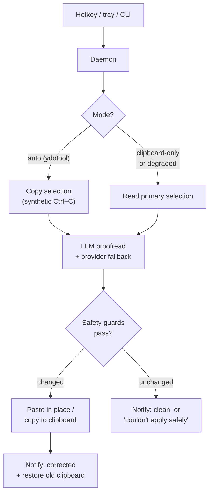
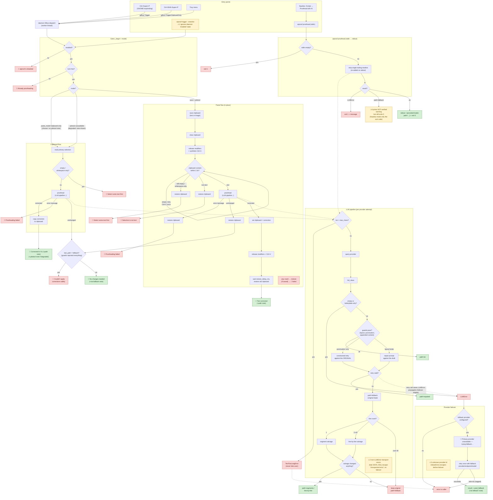

# aiproof flow

How a trigger becomes corrected text. Every branch below is pinned by a test
in `tests/test_flow_*.py` (run `make test-flow` for a route-by-route log
report in `build/flow-report.md`).

Both charts are flowcharts because the branch structure is the point; a
sequence diagram would show the clipboard/keystroke timing better but needs
one diagram per route.

## The simple version

## The detailed version

`🔔` = desktop notification (the exact strings are asserted in the flow
tests). `⚠n` = known quirk, listed below the chart.

### Known quirks

Characterized (not fixed) behaviors, each pinned by a test so a change shows
up as a test failure:

1. **Oneshot ignores the daemon's enabled state** — `aiproof trigger
   --oneshot` builds a fresh in-process orchestrator with `enabled=True`
   (`test_trigger_oneshot`).
2. **Non-LLMError transport errors bypass failover** — a malformed JSON
   response, SSL error, etc. escapes `query()` unwrapped, so the fallback
   provider is never tried and the user sees "Unexpected error"
   (`test_query_other_requests_errors_escape`, `test_unexpected_error`).
3. **An unknown primary provider id never falls back** — the primary client
   is built outside the failover try
   (`test_unknown_primary_provider_never_falls_back`). Related: an exception
   raised inside the `on_fallback` callback aborts the retry
   (`test_on_fallback_exception_aborts_retry`).
4. **`aiproof proofread` exits 0 when the guards rejected everything**
   (`path=fallback`): the warning goes to stderr, which the Nautilus script
   discards, so a file run can report "Proofread" on unverified output
   (`test_proofread_guards_rejected_warns_but_exit_zero`).

### What the flow tests do not cover

Daemon lifecycle (bus-name ownership, config-file watcher, startup checks,
state marshalling), tray menu, hotkey registration, and the settings UI are
exercised only manually — they are thin GTK/GLib glue around the routes
charted above.
